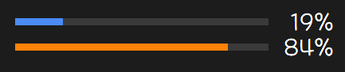
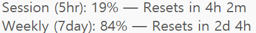

# claude-usage-taskbar

A [TrafficMonitor](https://github.com/zhongyang219/TrafficMonitor) plugin that displays your Claude AI usage (5-hour session and 7-day weekly) directly in the Windows taskbar.

| Taskbar | Hover |
|:---:|:---:|
|  |  |

## Prerequisites

- **Windows 10/11** (x64 or x86)
- **TrafficMonitor** v1.85+ ([download](https://github.com/zhongyang219/TrafficMonitor/releases))
- **Claude Code** installed and authenticated (`claude login`)

## Installation

1. Download the latest release zip for your architecture from [Releases](https://github.com/cubicj/claude-usage-taskbar/releases)
2. Extract `claude-usage-taskbar.dll` into TrafficMonitor's `plugins/` folder
   - To find this folder: **General Settings** → **Plug-in manage** → **Open plugin directory**
3. Restart TrafficMonitor
4. Right-click the taskbar window → **Taskbar Window Settings** → **Display settings...** → check **5h Usage** and/or **7d Usage**

## Configuration

Open settings via either:
- Right-click the taskbar window → **Plugin Options** → **Claude Usage Settings**
- **General Settings** → **Plug-in manage** → select the plugin → **Options**

| Setting | Default | Description |
|---------|---------|-------------|
| Credentials Path | *(auto-detect)* | Path to `.claude/.credentials.json`. Leave empty to use `%USERPROFILE%\.claude\.credentials.json` |
| Item Width | 160 | Display width in DPI-96 pixels (80–400) |
| Poll Interval | 60 | API poll interval in seconds (10–3600) |

Settings are stored in `claude-usage-taskbar.ini` next to the DLL.

## Usage

- Data refreshes automatically at the configured poll interval (default: 60s)
- **Click** the plugin item to force an immediate refresh — the display shows `...` while fetching
- Hover over the item for a tooltip with reset times and error details

## Troubleshooting

| Problem | Solution |
|---------|----------|
| "Credentials not found" | Install Claude Code and run `claude login` |
| "Authentication failed" | Run `claude login` to re-authenticate |
| No data shown | Click the plugin item to force refresh, or check TrafficMonitor logs |
| Plugin not visible | Ensure DLL architecture matches TrafficMonitor (x64 vs x86) |

## Building from Source

Requirements: Visual Studio 2022 Build Tools (MSVC v143), C++17

```bash
# x64
MSBuild claude-usage-taskbar.vcxproj -p:Configuration=Release -p:Platform=x64

# x86
MSBuild claude-usage-taskbar.vcxproj -p:Configuration=Release -p:Platform=Win32
```

Output: `build/Release-x64/` or `build/Release-x86/`

## License

[MIT](LICENSE)
